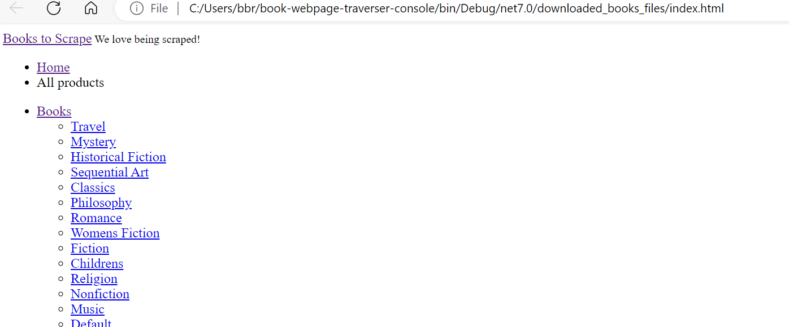

# Book Webpage Scraper Console

This is a console program developed in C# to traverse and download all pages and resources from books.toscrape.com. It allows users to download HTML pages, images, and other resources while maintaining the file structure of the website. The application makes use of asynchronous, parallel, and threading techniques for efficient traversal and downloading.

## Features

- **Page Traversal**: The application asynchronously traverses all pages on the specified website and downloads their content.
- **Resource Download**: It utilizes parallelism and threading to download and save all files (pages, images, etc.) to disk while keeping the file structure intact.
- **Progress Information**: Provides progress information in the console, indicating the status of the download process.

## Architecture

The Book Webpage Scraper Console application follows a modular architecture, utilizing the following components:

- **Scraper Handler Service**: Responsible for handling the scraping process, including fetching HTML documents, saving pages to disk, and downloading resources.
- **Scraper Runner**: Orchestrates the scraping process, initiating the traversal and download tasks.
- **Startup Configuration**: Configures the dependency injection container to resolve the necessary services.

## Methods

The application includes the following main methods:

- **ScrapeBookPages(string baseUrl, string outputPath)**: Initiates the scraping process by asynchronously traversing the website and downloading pages and resources.
- **FetchHtmlDocument(string url)**: Fetches an HTML document from the specified URL using HttpClient asynchronously.
- **SaveHtmlPage(string htmlContent, string folderPath, string fileName)**: Saves an HTML page to the specified folder path.
- **ScrapeBookPage(string baseUrl, string booksFolder, ConcurrentDictionary<string, string> urlToLocalPathMap)**: Handles the scraping process for book pages.
- **ExtractAndDownloadImages(HtmlDocument htmlDocument, string baseUrl, string bookFolder, ConcurrentDictionary<string, string> urlToLocalPathMap)**: Extracts and downloads images from the HTML document asynchronously.
- **ExtractAndDownloadPages(HtmlDocument htmlDocument, string baseUrl, string bookFolder, ConcurrentDictionary<string, string> urlToLocalPathMap)**: Extracts and downloads linked pages from the HTML document asynchronously.

## Installation and Usage

1. **Clone the Repository**: `git clone https://github.com/Mullu/book-webpage-traverser-console.git`
2. **Navigate to the Project Directory**: `cd book-webpage-traverser-console`
3. **Build the Application**: `dotnet build`
4. **Run the Application**: `dotnet run`

The downloaded book files (images, pages, etc.) will be available at `/path/to/repo/bin/Debug/net7.0/downloaded_books_files`.

Here is sample output from my local machine:

Here is the index page contents and Books folder content:

## Configuration

No additional configuration is required for the application to run. However, users can modify constants in the code, such as maximum concurrency level and file names, to adjust the behavior of the scraper.

## Dependencies

The application relies on the following external libraries:

- **HtmlAgilityPack**: Used for parsing HTML documents and extracting elements.

## Asynchronicity, Parallelism, and Threading

The Book Webpage Scraper Console makes extensive use of asynchronous programming, parallelism, and threading to optimize performance and resource utilization. It utilizes asynchronous methods for fetching HTML documents and downloading resources, allowing multiple tasks to run concurrently without blocking the main thread. Parallelism is employed to speed up the process of downloading images and linked pages by processing them simultaneously. Threading, specifically using SemaphoreSlim, is utilized to control the level of concurrency and prevent resource contention, ensuring efficient resource management and preventing overload.

For further insights into implementing concurrency control using SemaphoreSlim and exploring alternative approaches, you can refer more this article ["C# Elegant Way Traverse Many URLs"](https://learn.microsoft.com/en-us/answers/questions/1055027/c-elegant-way-traverse-many-urls.html).

## Testing

Unit tests have been implemented to ensure the functionality of the application. You can find the tests in the `ScraperRunnerTests.cs` file under the `BookWebPageScraper.Tests` namespace.

## License

This project is licensed under the MIT License. See the LICENSE file for details.
